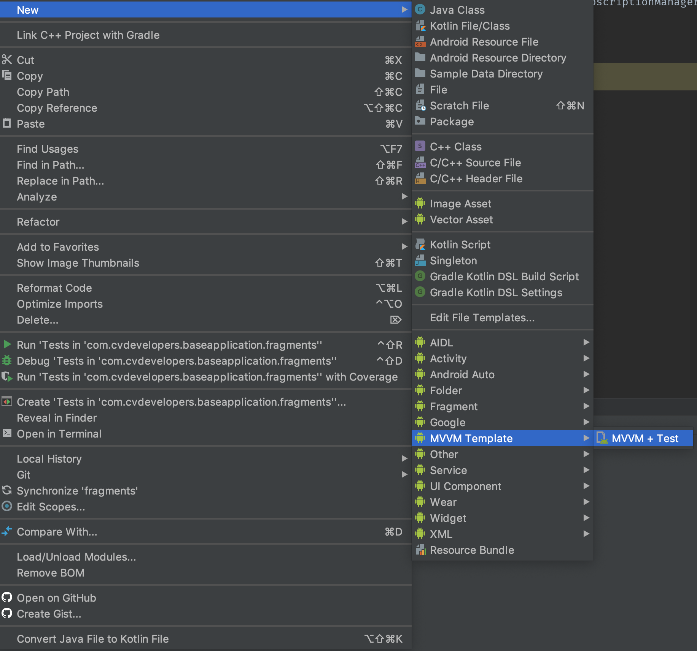

# MVVM-Templates
Set of templates to autogenerate MVVM classes and test

clone the repository to the following path: 
`$ANDROID_STUDIO_FOLDER$/Contents/plugins/android/lib/templates/other/MVVM-Templates`

To use, create a package folder where you want your files to be created, Right click then new -> MVVM Template -> MVVM + Test

Select wheather it is a fragment or an activity
